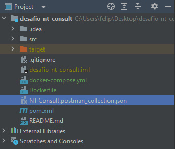

# Desafio Backend - Sistema de Reserva de Hotéis

## 📄 Descrição

Este projeto é uma implementação de uma API REST para um sistema de reserva de hotéis escalável. A aplicação permite aos usuários pesquisar, comparar e reservar quartos de hotel, gerenciando um grande volume de acessos simultâneos. 

## ⚙️ Funcionalidades Implementadas

- **Pesquisa de Hotéis**:
    - Permite a busca de hotéis com base em critérios como destino, datas de check-in e check-out, número de quartos e número de hóspedes.

- **Comparação de Opções**:
    - Comparação de hotéis por critérios como preço, localização, comodidades e avaliações de outros usuários.

- **Reserva de Quartos**:
    - Usuários podem reservar um hotel fornecendo informações de pagamento, nome e contato.

- **Sistema de Notificações com Kafka**:
    - Notificações são enviadas para confirmar o processamento de reservas com seu devido status.
    - Garantia de entrega confiável de notificações, mesmo em caso de falhas temporárias no sistema.

- **Persistência de Dados**:
    - O banco de dados utilizado é o **MySQL** (anteriormente PostgreSQL), justificando a escolha pela facilidade de integração e robustez para sistemas de médio e grande porte.

- **Monitoramento e Logs**:
    - Implementação do **Spring Boot Actuator** para monitoramento em tempo real e logs abrangentes sobre o desempenho e a saúde do sistema.

## 🔗 Endpoints

### **Pesquisa de Hotéis**
- **GET `/api/hotels/search`** - Pesquisa hotéis com base em critérios como destino, datas de check-in, check-out, número de quartos e número de hóspedes.

### **Comparação de Hotéis**
- **GET `/api/hotels/compare`** - Compara hotéis por preço, localização, comodidades ou avaliações. O parâmetro padrão de comparação é o `price`.

### **Gestão de Hotéis**
- **POST `/api/hotels/create`** - Cadastra um novo hotel.
- **DELETE `/api/hotels/{id}`** - Remove um hotel por ID.
- **GET `/api/hotels`** - Retorna o número total de hotéis.

### **Gerenciamento de Reservas**
- **POST `/api/bookings/create`** - Cria uma nova reserva.
- **POST `/api/bookings/reserve`** - Faz o check-in para uma reserva existente, processando o booking com detalhes do hóspede e pagamento.
- **GET `/api/bookings/list`** - Retorna todas as reservas de um determinado hotel através do parâmetro `hotelId`.
- **GET `/api/bookings`** - Retorna o número total de reservas.

## 🛠️ Tecnologias Utilizadas

- **☕ Java 21**
- **Spring Framework:**
    - 🥾 Spring Boot
    - 📊 Spring Data JPA
    - 📜 Spring Kafka para notificações
    - 🧑‍💻 Spring Boot Actuator para monitoramento
- **🐬 MySQL** (anteriormente PostgreSQL)
- **🔄 Docker e Docker Compose**
- **📄 Lombok**
- **🧪 JUnit 5 e Mockito para testes unitários**

## 📁 Postman Collection

Uma coleção Postman foi disponibilizada na raiz do projeto, com todos os endpoints da API configurados. O arquivo está localizado no diretório raiz como `NT Consult.postman_collection.json`.


## 🧰 Requisitos para Execução

- **Java 21** ou superior
- **Maven**
- **Docker** e **Docker Compose**

## 🚀 Como Executar o Projeto

### 1. Clonar o repositório

```bash
git clone https://github.com/FelipeAumannRS/desafio-nt-consult
cd desafio-nt-consult
```

### 2. Construir o projeto e criar a imagem Docker

```bash
mvn clean install
docker build -t nt-app .
```

### 3. Subir a aplicação com Docker Compose
```bash
docker-compose up --build
```
Isso iniciará a aplicação, o banco de dados MySQL e o Kafka em containers Docker.

## 📝 Critérios de Avaliação Implementados

- **Implementação Completa e Precisa dos Requisitos**: O projeto cobre todos os requisitos funcionais solicitados, incluindo a pesquisa, comparação e reserva de hotéis, além da integração com Kafka para notificações.

- **Eficiência e Escalabilidade**: O sistema foi desenvolvido com Kafka para gerenciar notificações de forma eficiente, permitindo escalabilidade ao lidar com um grande volume de reservas e acessos simultâneos.

- **Garantia de Entrega de Notificações**: Em caso de falhas temporárias no sistema, o Kafka garante que as notificações sejam entregues de maneira confiável.

- **Persistência Correta dos Dados**: O **MySQL** foi escolhido como o banco de dados devido à sua robustez e confiabilidade para manipulação de um grande volume de transações. O MySQL garante a integridade e consistência dos dados durante a reserva e atualização de informações.

- **Logs e Monitoramento**: O **Spring Boot Actuator** foi utilizado para fornecer métricas em tempo real e monitorar a saúde do sistema, permitindo uma visibilidade total do desempenho da aplicação.

## 💡 Melhorias Futuras

- **Adicionar Operações CRUD Completas**: Atualmente, as operações de **DELETE**, **INSERT** e **READ** foram implementadas. Para aprimorar a solução, podemos adicionar operações de **UPDATE** para concluir o CRUD completo.

- **Melhoria nos Testes**: O sistema conta com testes unitários básicos. A inclusão de testes de integração e uma cobertura mais ampla dos cenários de negócios podem aumentar a confiabilidade do código.

- **Integração com Cache**: Para melhorar ainda mais a escalabilidade e o desempenho em ambientes de alta carga, a introdução de cache distribuído pode ser considerada.

- **Balanceamento de Carga**: Em caso de um aumento significativo no tráfego, a implementação de balanceamento de carga ajudaria a distribuir as requisições de maneira eficiente entre diferentes instâncias da aplicação.
- **Fluxo de check out**: Implementação de fluxo de checkout, de forma a disponibilizar quartos do hotel uma vez ocupados.


## 📊 Monitoramento e Métricas

Foi implementado o **Spring Boot Actuator** para fornecer métricas e monitoramento do sistema, tais como:

- **Monitoramento de saúde**: Verifica a disponibilidade dos serviços.
- **Monitoramento de métricas**: Avalia o desempenho do sistema em termos de tempo de resposta, uso de memória, CPU, etc.

Você pode acessar as métricas utilizando o **Actuator** na URL padrão: `/actuator`.